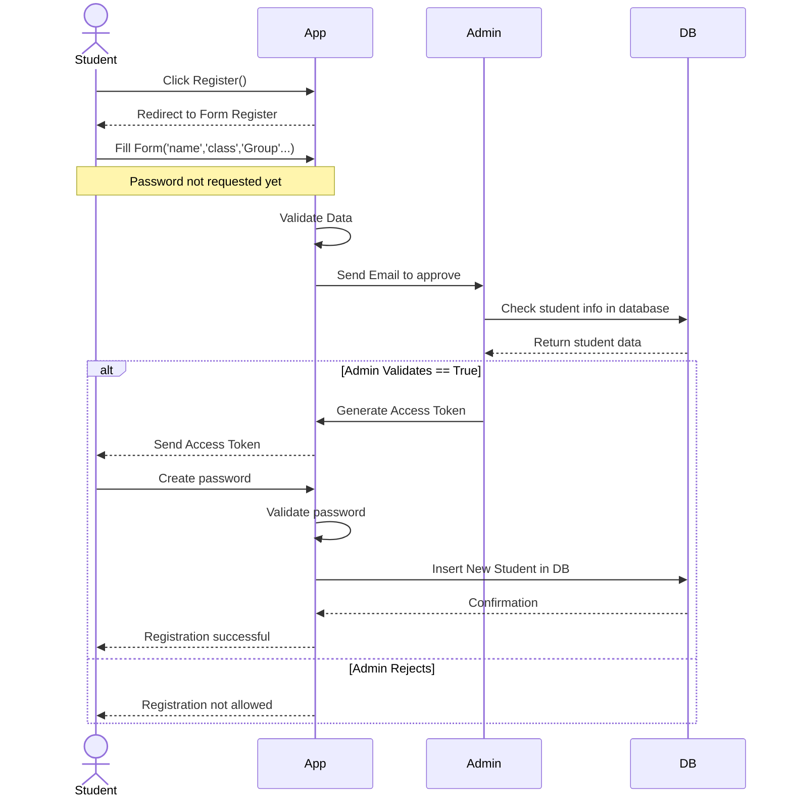
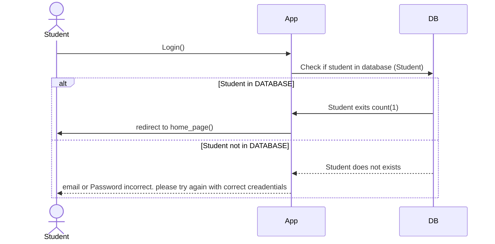
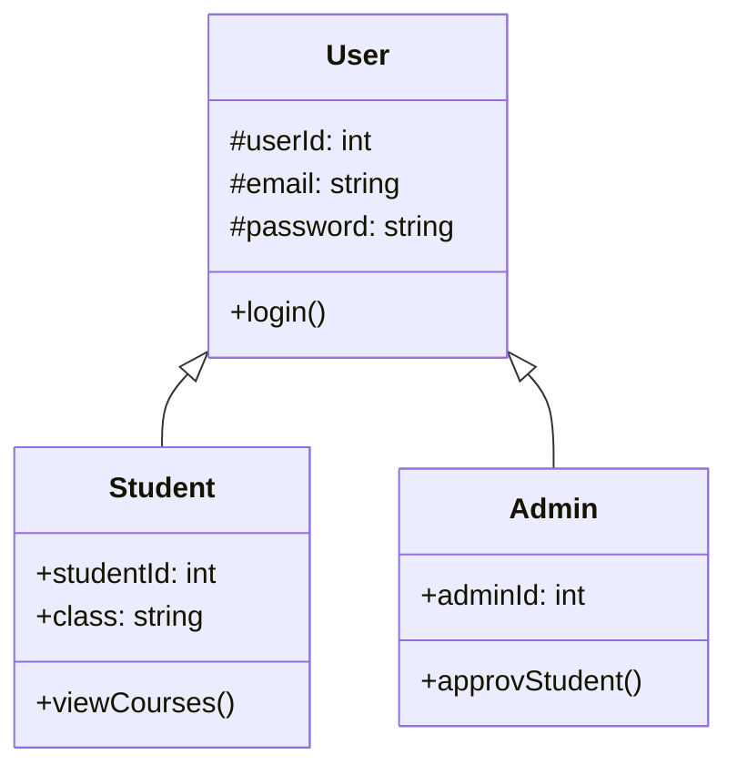

# English Station

## Sequence Diagrams
### Sequence diagram for Student Registration

### Sequence diagram Login Student

### Sequence diagram Admin create class

### Sequence diagram admin create cours 

### Sequence diagram admin create chapter

### Sequence diagram admin affect cour to chapter

### Sequence diagram admin affect cours to class

## Class diagram

# Class Diagram

