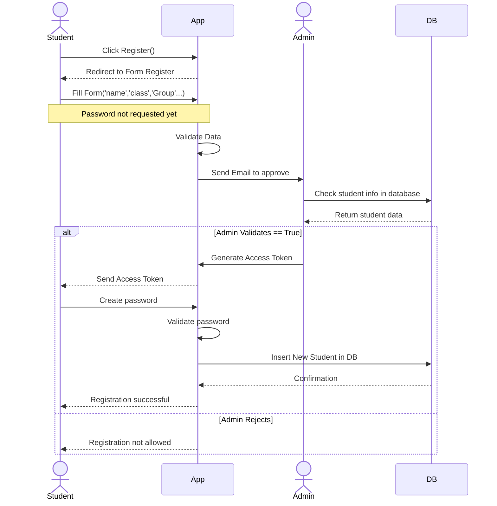
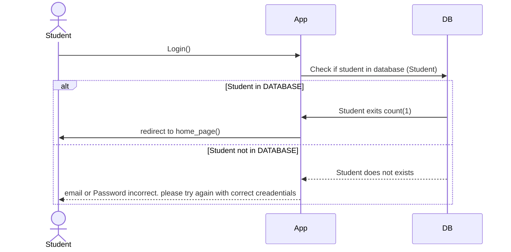

# English Station

---
## Sequence Diagrams
### Sequence diagram for Student Registration

---
### Sequence diagram Login Student


---
### Sequence diagram Admin create class Group like (1st)
```mermaid

```
---
### Sequence diagram admin create cours 
```mermaid

```

---
### Sequence diagram admin create chapter
```mermaid

```
---
### Sequence diagram admin affect cour to chapter

```mermaid

```

### Sequence diagram admin affect cours to class
```mermaid

```

---
## Class diagram

# Class Diagram

```mermaid
classDiagram
    class User {
        #userId: int
        #email: string
        #password: string
        #name: string
        #createdAt: date
        +login()
        +logout()
        +updateProfile()
    }

    class Student {
        +studentId: int
        +streamId: int
        +accessToken: string
        +viewCourses()
        +takExam()
        +downloadCourse()
        +submitAssignment()
    }

    class Admin {
        +adminId: int
        +approvPermissions: boolean
        +approvStudent()
        +rejectStudent()
        +addCourse()
        +addExam()
        +deleteStudent()
        +viewAllStudents()
    }

    class AcademicLevel {
        <<enumeration>>
        FIRST_YEAR
        SECOND_YEAR
        THIRD_YEAR
    }

    class stream {
        +streamId: int
        +name: string
        +description: string
        +level: AcademicLevel
        +addCourse()
        +getStudents()
        +getCourses()
    }

    class Course {
        +courseId: int
        +title: string
        +description: string
        +streamId: int
        +createdBy: int
        +format: string
    }


    class Exam {
        +examId: int
        +courseId: int
        +title: string
        +passingScore: int
        +duration: int
        +createQuestion()
        +evaluateExam()
    }

    class Question {
        +questionId: int
        +examId: int
        +text: string
        +options: string[]
        +correctAnswer: string
        +difficulty: string
    }
    
    User <|-- Student
    User <|-- Admin
    
    stream "1" -- "0..*" Student : enrolls
    stream "1" -- "0..*" Course : contains
    AcademicLevel "1" -- "0..*" stream : has
    
    Course "1" -- "0..*" Exam : has
    Exam "1" -- "0..*" Question : contains
    
    Admin "1" -- "0..*" Course : creates
    Admin "1" -- "0..*" Exam : creates
    
    Student "0..*" -- "0..*" Course : takes
```