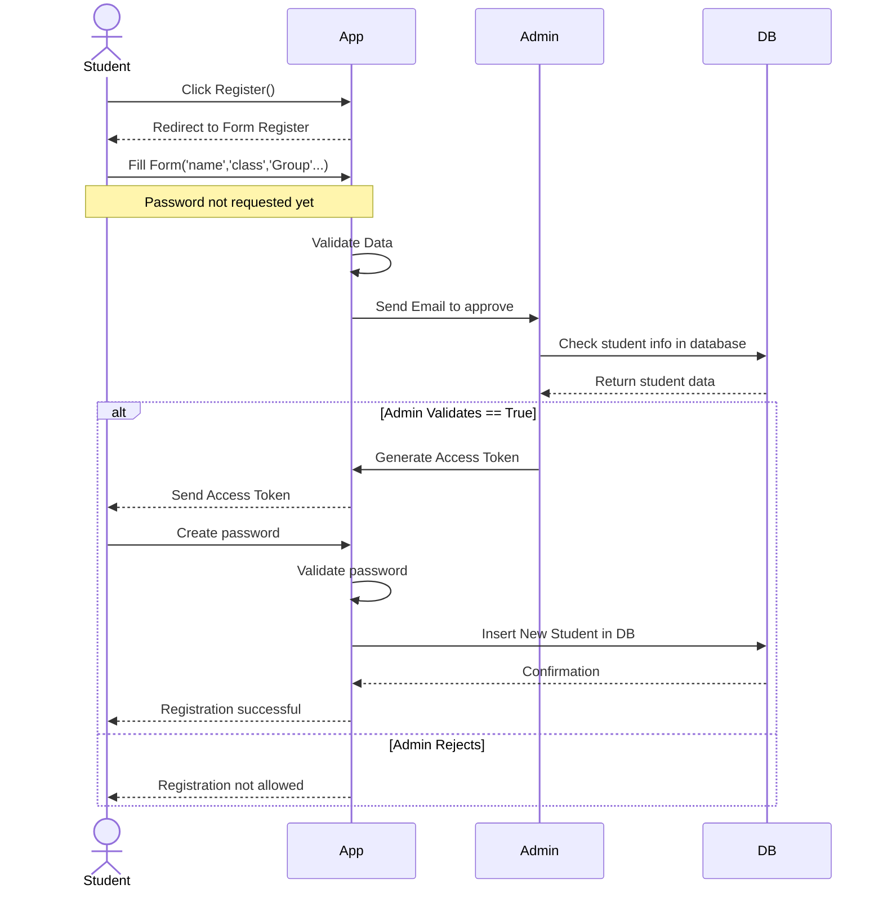

# English Station

## Sequence Diagrams
### Sequence diagram for Student Registration

```mermaid
sequenceDiagram
    actor Student
    participant App
    participant Admin
    participant DB
    
    Student->>App: Click Register()
    App-->>Student: Redirect to Form Register
    Student->>App: Fill Form('name','class','Group'...)
    Note over Student,App: Password not requested yet
    
    App->>App: Validate Data
    
    App->>Admin: Send Email to approve
    Admin->>DB: Check student info in database
    DB-->>Admin: Return student data
    
    alt Admin Validates == True
        Admin->>App: Generate Access Token
        App-->>Student: Send Access Token
        Student->>App: Create password
        App->>App: Validate password
        App->>DB: Insert New Student in DB
        DB-->>App: Confirmation
        App-->>Student: Registration successful
    else Admin Rejects
        App-->>Student: Registration not allowed
    end
```