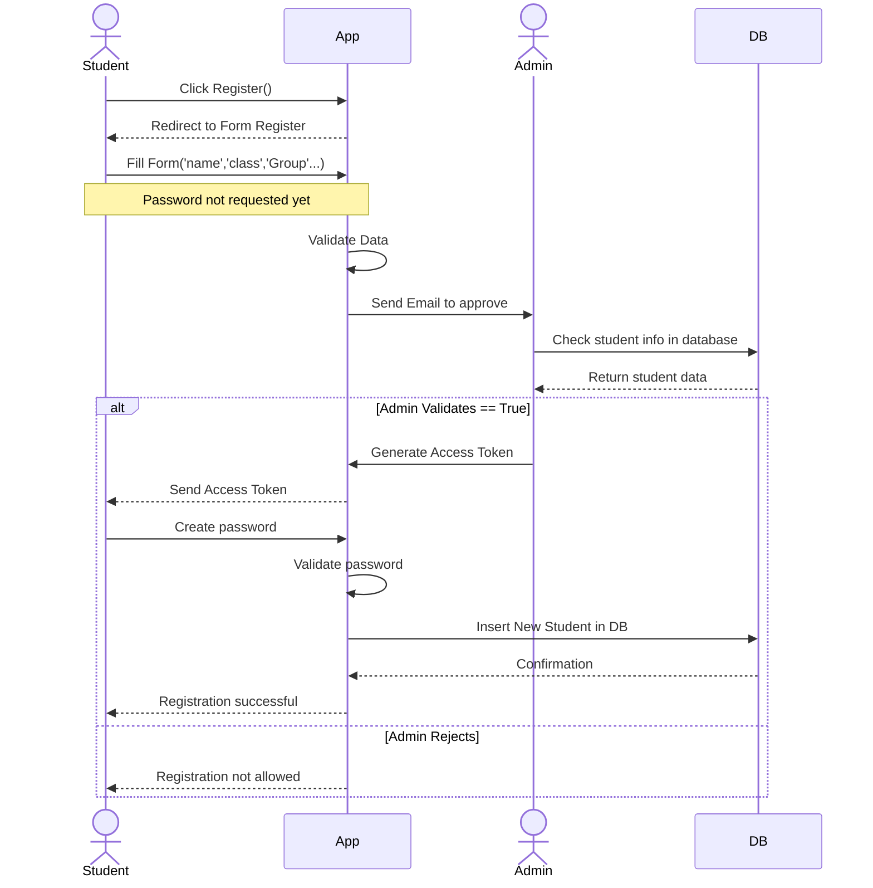
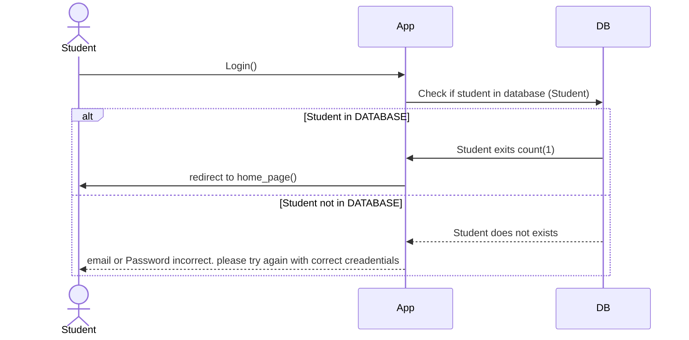
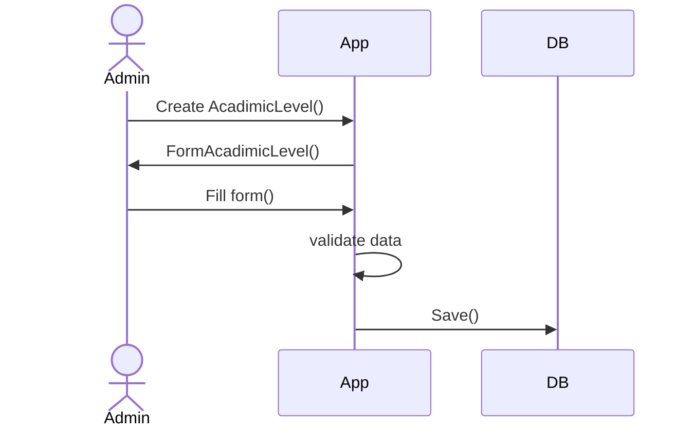
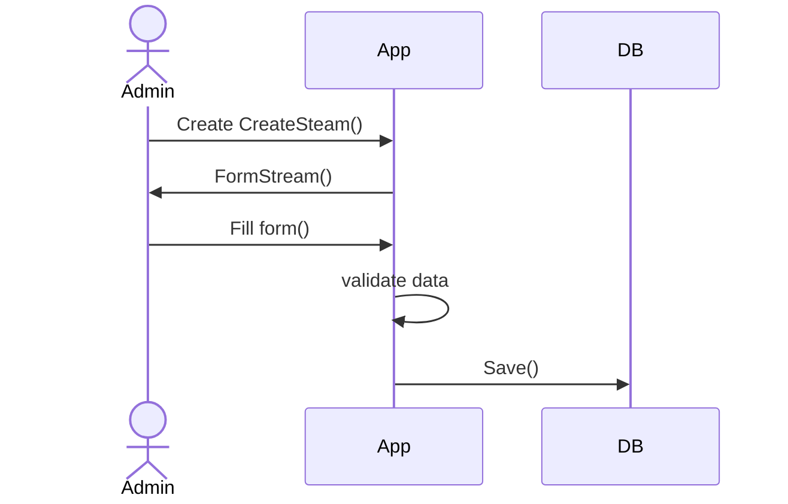
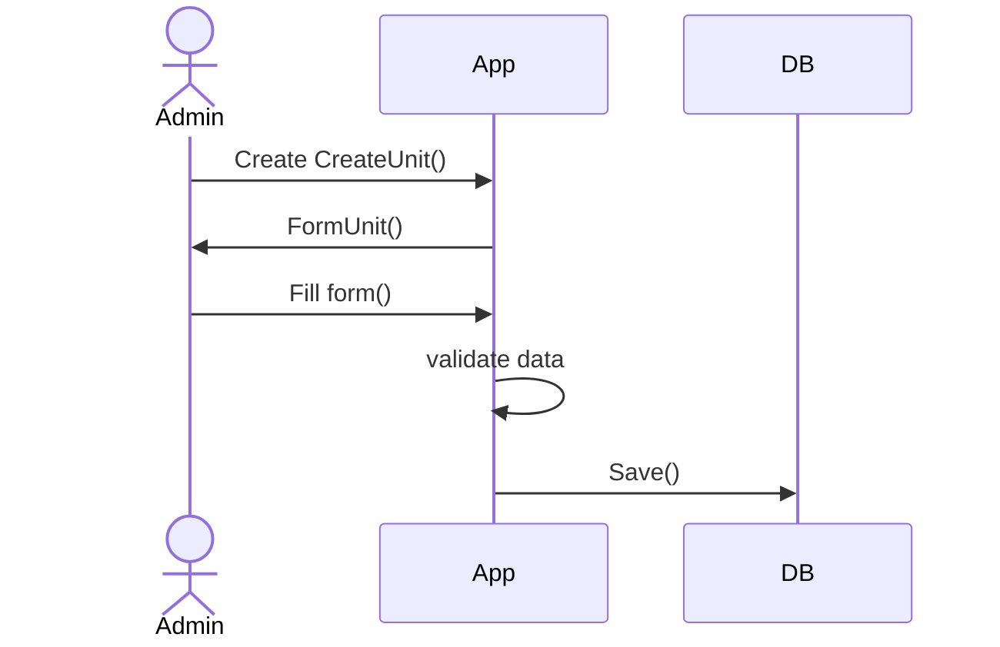
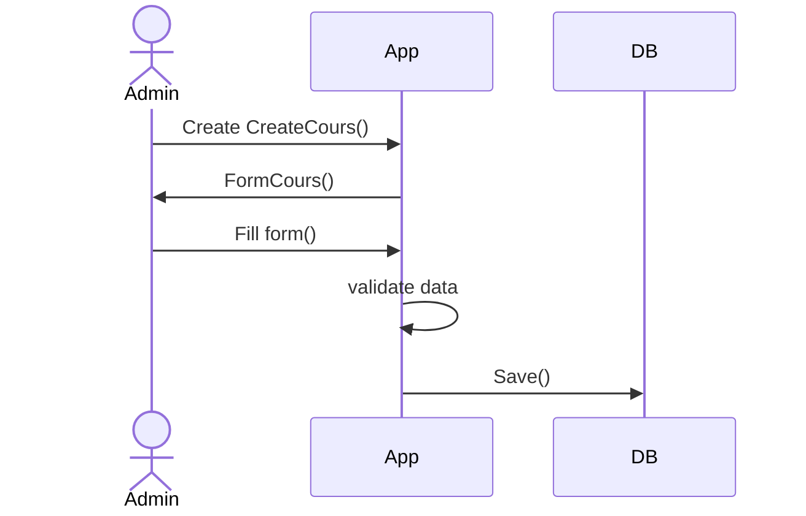
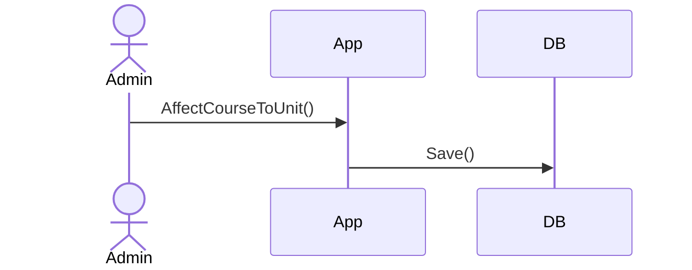
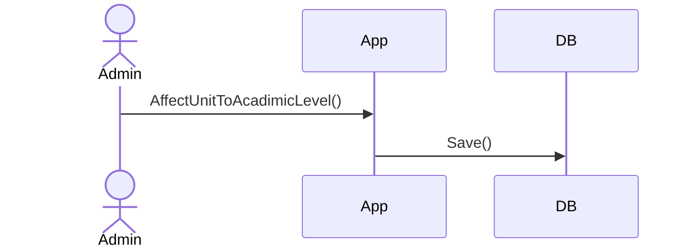
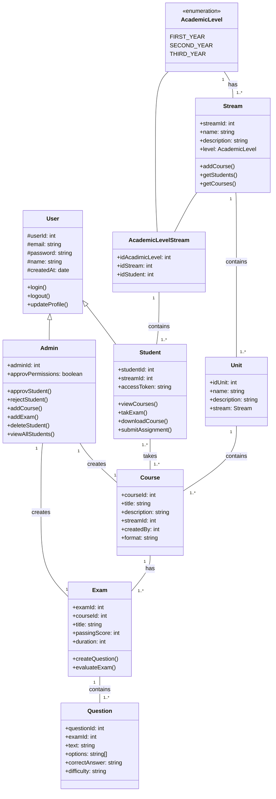

# English Station

---
## Sequence Diagrams
### Sequence diagram for Student Registration

---
### Sequence diagram Login Student

---
### Sequence diagram Admin create academicLevel Group like (1st, 2nd, 3rd)

---
### Sequence diagram admin create streams (Scientific, Leterary, Mathematic, Technical math)

---
### Sequence diagram Create Unit

---
### Sequence diagram admin create cours

---
### Sequence diagram admin affect cours to Unit

---
### Sequence diagram admin affect Unit to AcadimicLevel

---
# Class diagram

